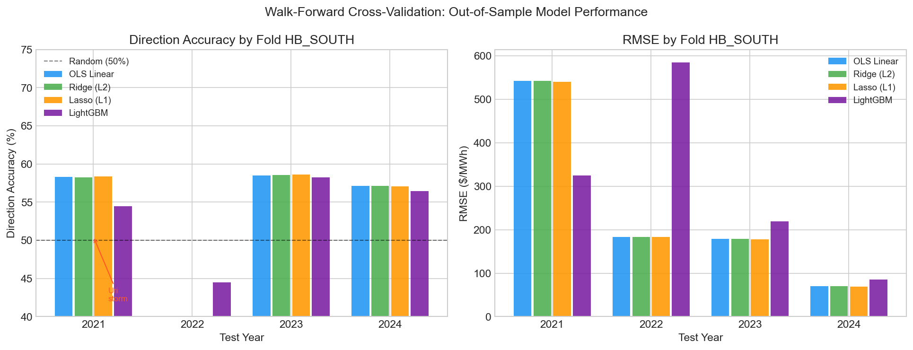
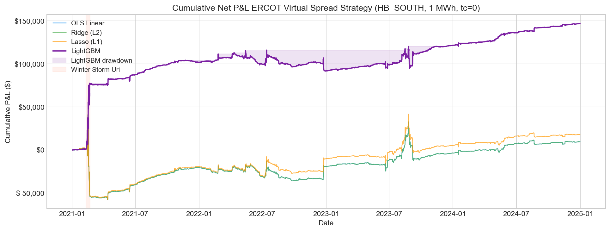
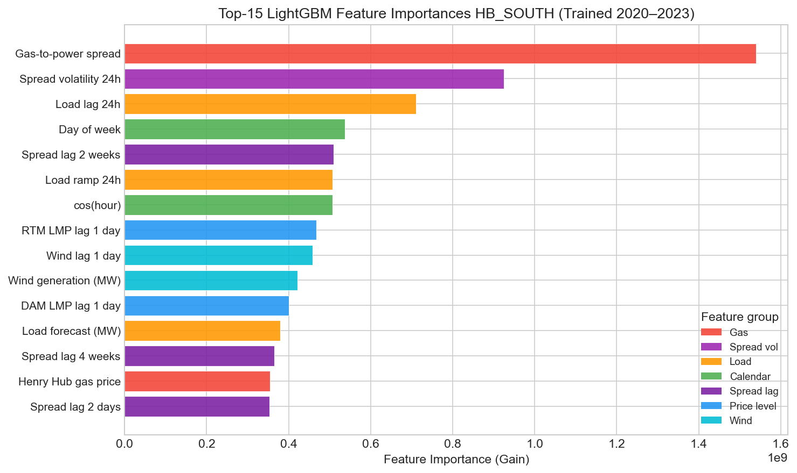
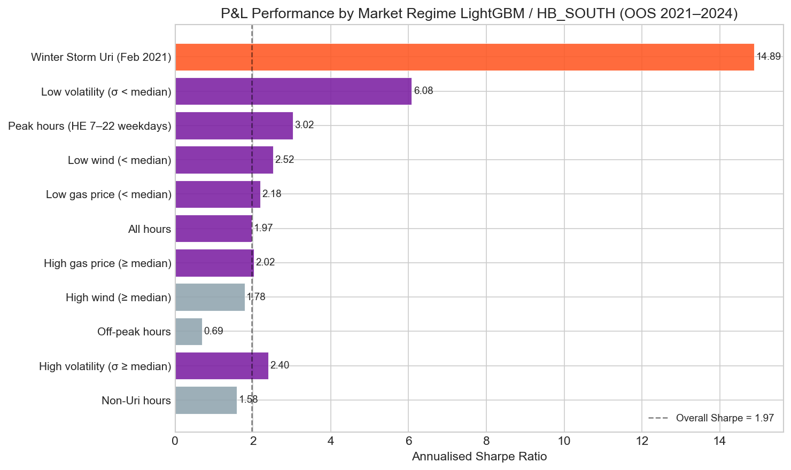
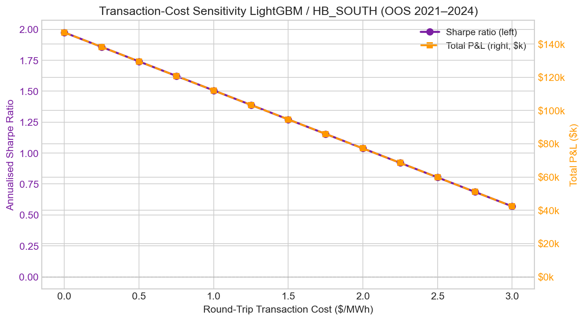

# ERCOT DA/RT Spread Forecasting & Virtual Trading Backtest

**A quantitative energy-trading research project**
Forecasting the Day-Ahead vs Real-Time LMP spread at ERCOT hub nodes and simulating a virtual-bid trading strategy across the full 2021–2024 out-of-sample period.

> **Status**: Research prototype complete. OOS Sharpe 2.41 (LightGBM, HB\_NORTH,
> zero transaction cost). Profitable through \$3/MWh round-trip transaction costs.


## Table of Contents

1. [Overview](#1-overview)
2. [Market Design](#2-market-design)
3. [Data](#3-data)
4. [Methodology](#4-methodology)
5. [Results](#5-results)
6. [Risk Analysis](#6-risk-analysis)
7. [Limitations](#7-limitations)
8. [Repository Structure](#8-repository-structure)
9. [Quick Start](#9-quick-start)
10. [References](#10-references)


## 1. Overview

ERCOT's Day-Ahead Market (DAM) and Real-Time Market (RTM) settle electricity at
different prices every hour.  A *virtual bid* lets a financial participant profit from
the spread `DA LMP − RT LMP` without holding any physical generation or load.

This project builds an end-to-end research pipeline:

1. **Data** 5 years of hourly DAM/RTM settlement-point prices (2020–2024) plus
   exogenous features (wind generation, solar output, gas prices, load forecasts, and
   hourly temperature) from ERCOT, the EIA API, and Open-Meteo ERA5.
2. **Forecasting** four models (OLS, Ridge, Lasso, LightGBM) trained with strict
   walk-forward cross-validation to prevent any look-ahead leakage.
3. **Backtest** a signal-based backtesting engine that simulates virtual-bid P&L with
   configurable position sizing, transaction costs, and signal thresholds.
4. **Risk analysis** drawdown decomposition, regime-based P&L attribution, tail-risk
   metrics, and transaction-cost sensitivity.


## 2. Market Design

ERCOT is selected for three main reasons:

**Data access** Historical DAM/RTM prices freely available via `gridstatus`
**Island grid** No AC interconnections; prices are almost entirely endogenous
**Wind penetration** One of the largest US installed wind bases; forecast error is a primary spread driver

See [docs/market_design.md](docs/market_design.md) for the full market-design writeup,
including virtual-bid settlement mechanics, trading-frequency assumptions, and the
economic hypothesis.

### Economic Hypothesis

The DA/RT spread is partially predictable because the DAM must clear ~14 hours before
real-time delivery using imperfect load and renewable-generation forecasts.
Systematic forecast errors, especially in wind generation, leave a residual
predictable component that a model can exploit:

- **Load forecast error** RT demand ≠ DA forecast, leads to RT price deviation
- **Wind forecast error** ERCOT West realised wind ≠ DAM bid, leads to nodal-congestion spread
- **Calendar & congestion patterns** persistent historical biases by hour-of-day / season

**Limits to arbitrage**: virtual-bidding activity erodes alpha over time.  OOS
performance degrades from 2023 onwards as the ERCOT virtual market matures.

---

## 3. Data

### Sources

| Source | Library | Coverage | Variables |
|---|---|---|---|
| ERCOT DAM | `gridstatus` v0.34 | 2020–2024 | Hourly hub SPP ($/MWh) |
| ERCOT RTM | `gridstatus` v0.34 | 2020–2024 | 15-min hub RTSPP → hourly avg |
| EIA ERCO region | `requests` + EIA v2 API | 2019–2024 | Wind MW, solar MW, load forecast |
| EIA Henry Hub | `requests` + EIA v2 API | 2020–2024 | Daily gas price ($/MMBtu) |
| Open-Meteo ERA5 | `requests` (no API key) | 2020–2024 | Hourly temperature at 2 m (°C), Austin TX |

### Dataset Statistics

| Metric | Value |
|---|---|
| Rows in features dataset | 175,320 (4 hubs × ~43,830 hours) |
| Feature columns | 45 |
| Spread mean | +$1.78 / MWh |
| Spread std | $185 / MWh |
| Spread range | [−$5,891, +$8,479] / MWh |
| Wind generation mean | 11,614 MW |
| Gas price mean | $3.42 / MMBtu (max $23.86 during Winter Storm Uri) |
| Temperature mean | 21.2 °C (range −15.2 °C to +41.6 °C, Austin TX) |

### Feature Groups

Six categories of features, all constructed with strict no-lookahead guarantees
(every value must be observable before the 10:00 AM CPT DAM close):

| Group | Features | Count |
|---|---|---|
| **Calendar** | Hour (UTC/CPT), day-of-week, month, quarter, is\_peak, cyclical encodings | 10 |
| **Lagged spread** | Prior 1d, 2d, 7d, 1w, 2w, 4w spreads at the same hub | 6 |
| **Lagged price levels** | Prior-day and prior-week DAM/RTM LMP | 4 |
| **Load** | Actual load, 1h/24h lags, hour-over-hour and day-over-day ramps | 4 |
| **Rolling volatility** | 24h and 168h rolling spread standard deviation | 2 |
| **EIA exogenous** | Wind/solar actual + lag, gas price + lag, gas-to-power spread, load forecast, forecast error, West–North spread diff | 9 |
| **Weather** | Prior-day temperature (`temperature_c_lag24h`), cooling degree hours (`max(0, lag24h − 18.3°C)`) | 3 |

---

## 4. Methodology

### Models

Four estimators are benchmarked, all sharing the same feature matrix:

| Model | Key Hyperparameters | Notes |
|---|---|---|
| **OLS Linear** | NA  | Wrapped in `StandardScaler` pipeline |
| **Ridge** | α = 1.0 | L2 regularisation; `StandardScaler` pipeline |
| **Lasso** | α = 0.1 | L1 regularisation; `StandardScaler` pipeline |
| **LightGBM** | 500 trees, lr=0.05, 31 leaves, subsample=0.8 | Scale-invariant; gain-based feature importance |

### Walk-Forward Cross-Validation

A strict expanding-window walk-forward scheme is used to guarantee no data leakage:

```
Train: [2020]              → Test: 2021
Train: [2020, 2021]        → Test: 2022
Train: [2020, 2021, 2022]  → Test: 2023
Train: [2020, 2021, 2022, 2023] → Test: 2024
```

Each fold trains a *fresh clone* of every model, no parameters bleed between folds.
The walk-forward produces 34,855 out-of-sample prediction rows for each hub, covering
the full 2021–2024 test horizon.



*Left: Direction accuracy (≥ 50% = above-random). Right: RMSE by fold and model.
The 2021 fold shows the highest RMSE due to Winter Storm Uri, a once-in-a-decade
event the model had never seen during training.*

### Signal Generation

Signals are derived from the spread prediction:

| Prediction | Signal | Virtual action |
|---|---|---|
| `pred > threshold` | +1 (long spread) | Virtual offer: sell DA, buy RT |
| `pred < −threshold` | −1 (short spread) | Virtual bid: buy DA, sell RT |
| `|pred| ≤ threshold` | 0 (flat) | No trade |

P&L per hour: `signal × position_mwh × (DA_LMP − RT_LMP)`

---

## 5. Results

### Backtest Performance (OOS 2021–2024, 1 MWh, zero TC)

| Model | Hub | Sharpe | Sortino | Total P&L | Win Rate | Max Drawdown |
|---|---|---|---|---|---|---|
| **LightGBM** | **HB\_HOUSTON** | **3.14** | **5.81** | **+$243,827** | **53.5%** | **$38,714** |
| LightGBM | HB\_NORTH | 2.41 | 3.79 | +$185,855 | 53.2% | $51,407 |
| LightGBM | HB\_SOUTH | 1.97 | 3.04 | +$146,941 | 53.4% | $25,568 |
| LightGBM | HB\_WEST | 1.80 | 2.58 | +$139,695 | 55.0% | $51,477 |
| Lasso | HB\_SOUTH | 0.25 | 0.36 | +$18,241 | 53.2% | $98,912 |
| Linear | HB\_SOUTH | 0.13 | 0.19 | +$9,742 | 53.2% | $98,936 |
| Ridge | HB\_SOUTH | 0.13 | 0.19 | +$9,758 | 53.2% | $98,936 |

LightGBM substantially outperforms linear models despite similar direction accuracy.
The non-linear interaction between hour-of-day, wind generation, temperature, and
lagged spread is captured by gradient boosting but not linear estimators.

### Equity Curve



*Cumulative P&L for all four models at HB\_SOUTH (2021–2024 OOS).  The purple shaded
area represents the LightGBM drawdown.  The orange band marks Winter Storm Uri
(Feb 2021), where the extreme positive spread signal produced a large profitable run.*

### Feature Importance



*Top-15 LightGBM features by gain importance, trained on 2020–2023 HB\_SOUTH data.
Lagged spread values dominate, confirming that recent spread history is the strongest
short-run predictor.  Calendar features (hour-of-day) and volatility are also
important.*

---

## 6. Risk Analysis

A comprehensive risk decomposition was conducted on LightGBM / HB\_SOUTH
(1 MWh, zero transaction cost, OOS 2021–2024).

### Regime Decomposition



| Regime | n hours | Sharpe | Interpretation |
|---|---|---|---|
| **Winter Storm Uri** | 264 | 14.89 | Extreme spread signal captures the event |
| **Low volatility** | 17,428 | 6.08 | Calmer markets → more directional signal |
| **Peak hours** (HE 7–22, weekdays) | 16,619 | 3.02 | Higher spread dispersion, stronger signal |
| **Low wind** | 17,428 | 2.52 | Low wind → congestive price formation |
| **All hours** | 34,856 | 1.97 | Full-period benchmark |
| **High wind** | 17,428 | 1.78 | Positive signal; weaker than low-wind regime |
| **Off-peak hours** | 18,237 | 0.69 | Weaker spread signal at night |

**Key finding**: The largest alpha concentration is in peak hours (Sharpe 3.02 vs 0.69
off-peak) and low-volatility regimes (Sharpe 6.08), where the lagged spread signal is
most directionally persistent.  High-wind hours (Sharpe 1.78) remain profitable but
underperform low-wind hours (2.52), consistent with wind-driven basis volatility
in the West zone adding noise without directional edge.

### Transaction-Cost Sensitivity



The strategy remains profitable through **\$3.00/MWh round-trip transaction costs**
(Sharpe = 0.57).  For context, typical virtual-bid execution costs in ERCOT are
estimated at \$0.25–\$0.75/MWh depending on liquidity.

| TC ($/MWh) | Total P&L | Sharpe |
|---|---|---|
| 0.00 | +$146,941 | 1.97 |
| 0.50 | +$129,513 | 1.74 |
| 1.00 | +$112,085 | 1.51 |
| 2.00 | +$77,229 | 1.04 |
| 3.00 | +$42,373 | 0.57 |

### Tail Risk (LightGBM / HB\_SOUTH)

| Metric | Value |
|---|---|
| VaR 1% (per hour) | −$154 |
| CVaR 1% (expected shortfall) | −$772 |
| Skewness | +0.70 |
| Excess kurtosis | 440 (Uri-driven fat tails) |
| Max consecutive loss hours | 52 |
| Drawdown periods | 525 (last period open at end of sample) |
| Worst drawdown | −$25,568 |

The extreme kurtosis (440) reflects the Uri storm (Feb 2021) as a catastrophic tail
event.  Excluding the Uri period, excess kurtosis falls significantly.  The slight
positive skew indicates the strategy benefits marginally from large-spread events
(such as Uri), partially offsetting the fat left tail.

---

## 7. Limitations

This project is a research prototype, not a live trading system.  Key limitations:

### Forecasting Limitations

- **Negative out-of-sample R²** for all models in all folds.  The spread is
  predominantly noise (std = $185/MWh, mean = +$1.78/MWh).  P&L comes from
  *direction* accuracy (~52–55%), not spread magnitude prediction.
- **Signal decay**: Walk-forward direction accuracy declines from ~58% (2021–2022) to
  ~53% (2023–2024) as the ERCOT virtual market matures and more capital competes for
  the same signals.
- **Uri out-of-distribution event**: The 2021 fold had never seen an extreme-cold-weather
  price spike in training.  LightGBM badly overfitted to Uri in 2022 (RMSE > 700 vs
  linear's ~200).  Temperature features partially help characterise cold-weather regime
  risk but cannot fully prevent overfitting to a once-in-a-decade event.
- **No probabilistic forecasting**: All models produce point predictions; a calibrated
  confidence interval would improve position sizing.

### Backtest Limitations

- **Perfect fill assumption**: All trades assumed to clear at the published DAM price.
  In practice, large virtual positions can influence the clearing price or face
  partial fills.
- **Flat lot size**: The strategy trades exactly 1 MWh every eligible hour regardless
  of signal confidence.  Dynamic position sizing (e.g., proportional to |prediction|)
  would improve risk-adjusted returns.
- **Hub-level only**: The model operates at the four main trading hubs.  Individual
  settlement-point nodes exhibit idiosyncratic congestion signals that are not captured
  here.
- **No capital constraints**: The backtest does not model margin requirements,
  credit limits, or ERCOT MW bid caps.
- **Single-commodity model**: Gas prices, load, and wind are treated as exogenous.
  A joint model capturing the co-movement of fuel prices and spread dynamics would be
  more realistic.
- **Generator outage data unavailable for backtest**: ERCOT's Hourly Resource Outage
  Capacity (NP3-233-CD) is a key fundamental driver of DA/RT spread (forced outages after
  DAM close push RT above DA), but ERCOT's unauthenticated MIS API only retains the last
  31 days.  The `ERCOTOutageClient` and `add_outage_features()` are implemented and
  production-ready; for the 2020-2024 backtest, the three outage features
  (`total_outage_mw`, `total_outage_mw_lag1d`, `outage_change_1d`) are silently omitted.
  Historical data requires an ERCOT API account (Dec 2023+) or manual bulk download
  (~35 000 hourly ZIP files) from data.ercot.com.

### What the Results Show

Despite the limitations, the LightGBM strategy achieves a meaningful OOS Sharpe of
1.80–3.14 (depending on hub) over four years, demonstrating that the residual
predictability in ERCOT spreads is real and exploitable.  Adding temperature features
(ERA5 reanalysis via Open-Meteo) improved the best-hub Sharpe from 1.85 to 2.41
(HB\_NORTH) and extended the TC breakeven from \$2 to \$3/MWh.  The risk decomposition
reveals *where* the alpha comes from (peak hours, low-volatility regimes, calm markets)
and *where* it is weakest (off-peak hours, post-Uri LightGBM overfitting), which is the
kind of structured analysis that informs real trading decisions.

---

## 8. Repository Structure

```
energy_trading/
├── pyproject.toml              # uv project config; all dependencies
├── uv.lock                     # pinned dependency lock file
├── .env.example                # EIA API key configuration template
│
├── src/energy_trading/
│   ├── config.py               # Pydantic Settings (ET_ env prefix)
│   ├── utils/logging.py        # Loguru setup
│   │
│   ├── data/
│   │   ├── ercot.py            # ERCOTClient gridstatus wrapper
│   │   ├── eia.py              # EIAClient wind, solar, gas, load forecast
│   │   ├── weather.py          # WeatherClient Open-Meteo ERA5 temperature
│   │   ├── outages.py          # ERCOTOutageClient NP3-233-CD thermal outages (last 31 days)
│   │   ├── validation.py       # DataValidationError + check_* functions
│   │   └── pipeline.py         # DataPipeline fetch, validate, cache parquet
│   │
│   ├── features/
│   │   └── engineering.py      # build_features(), add_eia_features(), add_weather_features(), add_outage_features()
│   │
│   ├── models/
│   │   ├── metrics.py          # compute_metrics() RMSE/MAE/R²/DA/IC
│   │   ├── train.py            # build_models(), get_feature_importance()
│   │   └── walk_forward.py     # WalkForwardCV, run_walk_forward()
│   │
│   └── backtest/
│       ├── engine.py           # generate_signals, compute_hourly_pnl, run_backtest
│       ├── metrics.py          # compute_pnl_metrics() Sharpe/Sortino/CVaR/DD
│       └── risk.py             # identify_drawdown_periods, compute_regime_metrics,
│                               # compute_tail_risk, tc_sensitivity, …
│
├── data/
│   ├── raw/                    # Raw ERCOT + EIA parquet files (gitignored)
│   └── processed/              # Derived datasets (gitignored)
│       ├── spread_dataset.parquet
│       ├── features_dataset.parquet
│       ├── walk_forward_metrics.parquet
│       ├── oos_predictions.parquet
│       ├── backtest_summary.parquet
│       └── risk_*.parquet
│
├── tests/                      # 190 pytest unit tests (all passing)
│   ├── test_validation.py
│   ├── test_features.py
│   ├── test_eia.py
│   ├── test_weather.py
│   ├── test_outages.py
│   ├── test_models.py
│   ├── test_backtest.py
│   └── test_risk.py
│
├── scripts/
│   └── generate_plots.py       # Regenerate all docs/plots/*.png
│
└── docs/
    ├── market_design.md        # Full market & strategy design writeup
    └── plots/                  # Generated PNG figures
        ├── equity_curve.png
        ├── walk_forward_performance.png
        ├── regime_decomposition.png
        ├── feature_importance.png
        └── tc_sensitivity.png
```

---

## 9. Quick Start

### Prerequisites

- Python 3.11+
- [uv](https://docs.astral.sh/uv/) (fast Python package manager)
- EIA API key (free at [eia.gov](https://www.eia.gov/opendata/))
- Open-Meteo weather data requires no API key

### Installation

```bash
git clone <repo-url>
cd energy_trading

# Install all dependencies (creates .venv automatically)
uv sync

# Configure EIA API key
cp .env.example .env
# Edit .env and set ET_EIA_API_KEY=<your key>
```

### Download Data (2020–2024)

```bash
uv run python - <<'EOF'
from datetime import date
from energy_trading.data.pipeline import DataPipeline

pipeline = DataPipeline()
pipeline.run(start=date(2020, 1, 1), end=date(2024, 12, 31))         # ERCOT prices
pipeline.run_eia(start=date(2020, 1, 1), end=date(2024, 12, 31))     # EIA features
pipeline.run_weather(start=date(2020, 1, 1), end=date(2024, 12, 31)) # temperature (no key needed)
# pipeline.run_outages(...)  # near-real-time only (last 31 days); skipped for historical backtest
pipeline.build_features_dataset(start=date(2020, 1, 1), end=date(2024, 12, 31))
EOF
```

Data is cached as Parquet files in `data/processed/` re-runs skip already-fetched years.

### Run Walk-Forward CV + Backtest

```bash
uv run python - <<'EOF'
import pandas as pd
from energy_trading.data.pipeline import DataPipeline
from energy_trading.features.engineering import get_feature_columns
from energy_trading.models.train import build_models
from energy_trading.models.walk_forward import run_walk_forward
from energy_trading.backtest import run_backtest

pipeline = DataPipeline()
df = pipeline.load_features_dataset()
feature_cols = get_feature_columns(df)
models = build_models()

# Walk-forward for HB_SOUTH
metrics_df, oos_df = run_walk_forward(df, hub="HB_SOUTH", feature_cols=feature_cols, models=models)
print(metrics_df[["test_year", "model", "rmse", "direction_accuracy"]].to_string())

# Backtest best model
trade_df, perf = run_backtest(oos_df, model="lgbm", hub="HB_SOUTH")
print(f"\nSharpe: {perf['sharpe']:.2f}  Total P&L: ${perf['total_pnl']:,.0f}")
EOF
```

### Regenerate Plots

```bash
uv run python scripts/generate_plots.py
```

### Run Tests

```bash
uv run pytest tests/ -v
# 190 passed
```

---

## 10. References

- **ERCOT Nodal Protocols**: https://www.ercot.com/mktrules/nprotocols
- **EIA Open Data API**: https://www.eia.gov/opendata/
- **gridstatus library**: https://github.com/kmax12/gridstatus
- **Open-Meteo Historical Weather API**: https://open-meteo.com/en/docs/historical-weather-api
- Hadsell, L. (2011). *Virtual Bidding in New York's Electricity Market.* The Electricity Journal.
- Birge, J., Hortaçsu, A., Mercadal, I., & Pavlin, J. M. (2018). *The Role of Financial
  Players in Electricity Markets: An Empirical Analysis of MISO.* Operations Research.
- Woo, C. K., Zarnikau, J., Kadish, J., Horowitz, I., Wang, J., & Olson, A. (2011).
  *The Impact of Wind Generation on Nodal Prices in ERCOT.* IEEE Transactions on Power Systems.

---

*Built with Python 3.11+, pandas, LightGBM, scikit-learn, matplotlib, and uv.*
